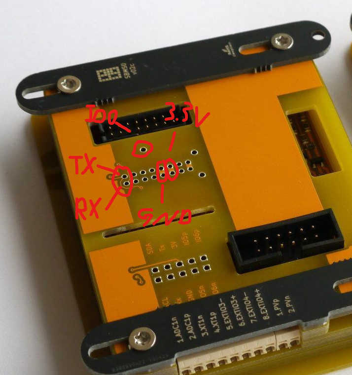

# electrodacus-esp32
[](https://travis-ci.com/armageddon421/electrodacus-esp32)

Firmware for the esp32 on the WiFi-addon of the [electrodacus BMS](http://www.electrodacus.com/).

## Current features

* Handle wifi connection to access point, fallback to provide own WiFi network in case no connection could be made.
* Vue.js based Webinterface for configuration
* Hosts unaltered electrodacus HTML file (apart from data URL)
* Provides raw data as read by HTML file (you can still use any local HTML file, just change the data URL to `http://[the IP of the device]/rawData`)
* Receiving and caching data from SBMS with unaltered firmware. (ignores AT commands)
* Parsing data from SBMS, usable by Consumers like the MQTT client. (currently only live data)
* MQTT client: publish live data in JSON format whenever it is received from the SBMS main board
* OTA Updates via ArduinoOTA


## Planned features

Not necessarily in that order.

* More configuration options (especially for MQTT and data rates)
* InfluxDB client: create InfluxDB Line-format and send to configurable Server
* NTP Timesync: add reliable timestamps to the data (in case of permanent internet connection)
* TLS encryption: add certificate based authentication and encryption for MQTT and possibly Influxdb endpoints

Please feel free to create issues for any suggestions. I've also added my plans there.

## Installation

This section describes how to update your SBMS' WiFi module to the latest version.

### current state

There will be browser based OTA updates and binary releases very soon. For now, refer to the instructions below.

### Requirements

If your SBMS does not come pre-flashed with an OTA capable firmware version yet, you need a USB to Serial/UART converter with an interface level of 3.3V. **5V will destroy your ESP32.** And any "PC" with any OS supported by plattformIO with installed python (2.7 should do). Make sure pip works.

### Wired Procedure



The basic procedure is as follows:
1. Disconnect the WiFi shield with the ESP32 module from your SBMS. To be safe, unplug the SBMS completely before doing that.
2. Connect the pins RX,TX,GND and 3.3V as shown in the illustration. Your USB to Serial converter will probably already provide 3.3V and enough power, so you can use that. The RX of your converter must be connected to the pin labeled TX and vice versa. It is probably easiest to use female jumper wires.
3. Make a temporary connection (hold a male jumper wire onto it) from the pin labelled IO0 to GND. This will bring the ESP32 into bootloader mode so you can flash the new firmware.
4. Only now plug in your USB to Serial converter to your USB port (or power up your dedicated 3.3V source). You can release the connection to IO0 now.
5. Flash the firmware (see next section)
6. Verify you can reach the device via WiFi. It should create an Access Point with a name starting with SBMS, followed by 12 characters representing a MAC-Address. The default password for that AP is "electrodacus" (without the quotes). Connect to it by going to `192.168.4.1` in your browser.
7. Disconnect everything you just connected before plugging the WiFi module back onto your SBMS.

### ArduinoOTA procedure

Make sure you are connected to the same WiFi as your SBMS, or are directly connected to its own WiFi.
Flash the firmware (see next section). In sections 4 and 6, add `-e ota --upload-port [IP/hostname]` to the end of the commands.
If you are directly connected to the SBMS' own WiFi, the IP will be `192.168.4.1`.

### Installation / Flashing

Open a terminal or cmd window.

1. Clone the repository by either downloading the zip file manually or running:
```
git clone https://github.com/armageddon421/electrodacus-esp32.git
```
And enter the directory
```
cd electrodacus-esp32
```
2. Install PlatformIO
```
pip install -U platformio
platformio update
```
3. Compile the code. Platformio will automatically install any missing dependancies. Check for any errors.
```
platformio run
```
If all goes well, you should see memory usage bars like these and a line below that reading [SUCCESS] in the middle.
```
RAM:   [=         ]  13.5% (used 44224 bytes from 327680 bytes)
Flash: [=======   ]  74.3% (used 973461 bytes from 1310720 bytes)
```
4. Flash! Platformio will usually find the right serial port to use automatically.
```
platformio run --target upload
```
Note: For OTA updates add `-e ota --upload-port [IP/hostname]` to the end of the commands.
5. After the process is finished, replug your USB (or power supply) to reboot the ESP32 and make sure the GPIO0 is still connected to GND so you can flash again.
6. Upload the filesystem
```
platformio run --target uploadfs
```
7. After the process is finished, disconnect GPIO0 and replug your USB (or power supply) to reboot the ESP32. That should be it.

## Frequently asked Questions (probably)

#### Why are there no binary releases?
The software required for the ESP32 consists of four distinct parts: Bootloader, partition table, application and file system. It is difficult to combine these into a single bin file and instructions to flash them would be error prone. Over the air updates are also a completely different situation. PlattformIO is quick and easy to install and use and handles most situations automatically. There is a pissibility to provide a target for automated one-click OTA updates at a later date.

#### What is MQTT?
[MQTT](http://mqtt.org/) is a publisher-subscriber based message passing protocol that uses a central server called "broker" to relay the messages. Many IoT applications nowadays support MQTT, devices as well as dashboard and home automation solutions. It is easy to locally host your own local MQTT-Broker (for example [Mosquitto](https://mosquitto.org/)) for your home automation needs, a raspberry pi is already enough.
I personally use [node-red](https://nodered.org/) as "glue logic" to connect all my sensors and actors, feed my databases and for creating logic.
